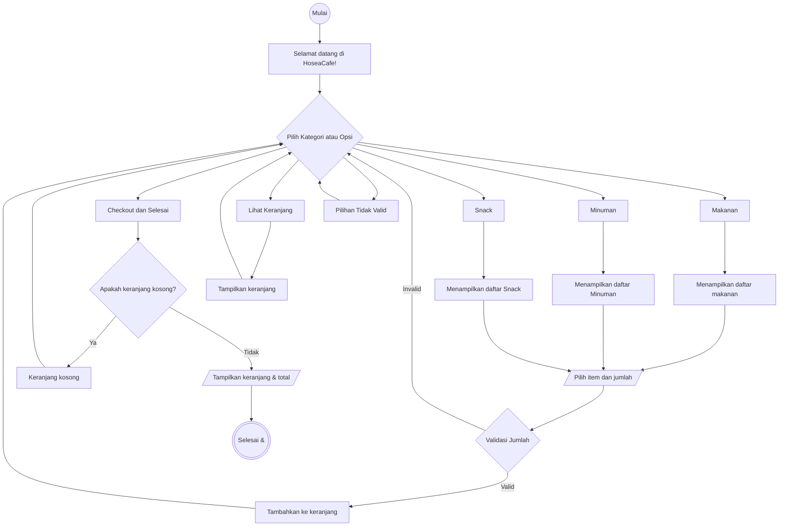

```mermaid

flowchart TD
    A@{ shape: circle,label: "Mulai"}
    B@{ shape: rectangle, label: "Selamat datang di HoseaCafe!"}
    C@{ shape: diamond,label: "Pilih Kategori atau Opsi"}
    D1@{shape: rectangle, label: "Makanan"}
    D2@{shape: rectangle, label: "Minuman"}
    D3@{shape: rectangle, label: "Snack"}
    D4@{shape: rectangle, label: "Lihat Keranjang"}
    D5@{shape: rectangle, label: "Checkout dan Selesai"}
    D6@{shape: rectangle, label: " Pilihan Tidak Valid"}
   E1@{shape:rectangle, label: "Menampilkan daftar makanan"}
   E2@{shape:rectangle, label: "Menampilkan daftar Minuman"}
   E3@{shape:rectangle, label: "Menampilkan daftar Snack"}

   F@{shape: lean-r, label: "Pilih item dan jumlah"}
   G@{shape: diamond, label: "Validasi Jumlah"}
   H@{shape: rectangle, label: "Tambahkan ke keranjang"}
   I@{shape: rectangle, label: "Tampilkan keranjang" }
   J@{shape : diamond, label: "Apakah keranjang kosong?"}
   K@{shape : rectangle ,label: " Keranjang kosong"}
   L@{shape : lean-r , label : "Tampilkan keranjang & total" }
   M@{shape: dbl-circ, label: " Selesai & "}
    A --> B
    B --> C
    C --> D1
    C --> D2
    C --> D3
    C --> D4
    C --> D5
    C --> D6

    D1 --> E1
    D2 --> E2
    D3 --> E3

    E1 --> F
    E2 --> F
    E3 --> F

    F --> G
    G -->|Invalid| C
    G -->|Valid| H
    H --> C

    D4 --> I
    I --> C

    D5 --> J
    J -->|Ya| K
    K --> C
    J -->|Tidak| L
    L --> M

    D6 --> C

```
