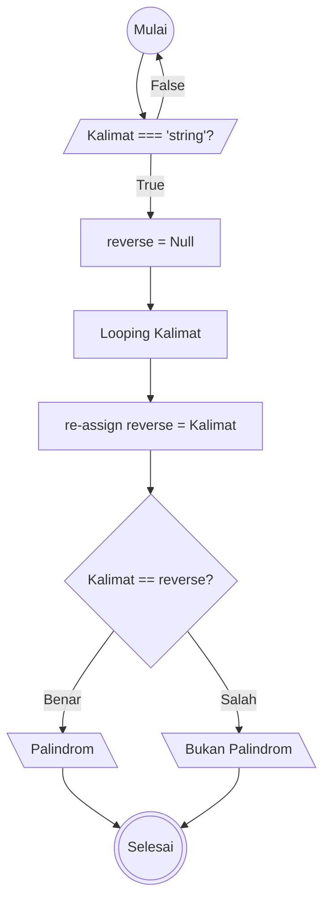
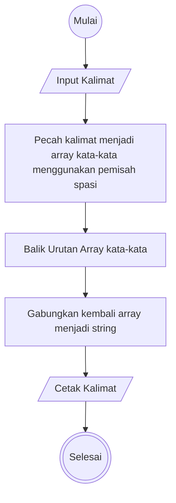

# Weekly Task 1 Aloritma & Javascript

## Algoritma Palindrom

1. Mulai
1. Input Kalimat
1. Validasi Kalimat
1. Buat Variable reverse
1. Loop Kalimat
1. Re assign Kalimat yang di balik ke reverse
1. Jika Kalimat di reverse sama dengan kalimat awal Print:"Palindrom"
1. Jika Tidak "Bukan Palindrom
1. Selesai

## Algoritma Reverse Word

1. Masukkan input berupa string/kalimat.
2. Pecah kalimat menjadi array kata-kata menggunakan pemisah spasi.
3. Balik urutan array kata-kata.
4. Gabungkan kembali array menjadi string.
5. Cetak kalimat hasil.
6. Selesai.

